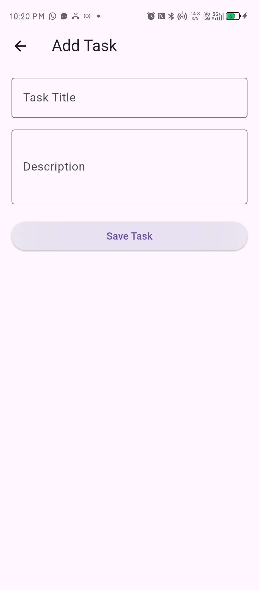
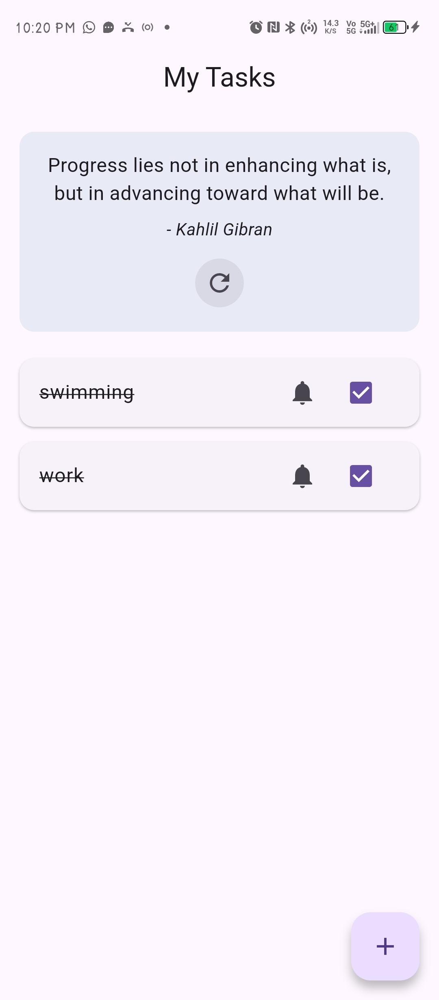
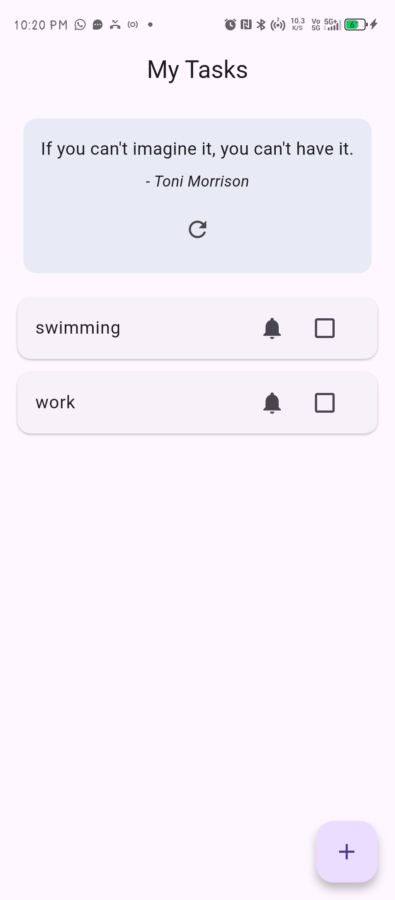

# TodoQuotesApp

A simple and clean **To-Do List App with Motivational Quotes** built using Flutter.

This project was created to improve my skills in:
- Flutter UI development
- Local database (Hive)
- State management (Provider)
- API integration
- Mobile app features like notifications

---

## Features

✅ Add, view, and manage tasks  
✅ Mark tasks as completed  
✅ Persistent storage using Hive (offline support)  
✅ Motivational quotes from API  
✅ Refresh quotes anytime  
✅ Task reminder notifications  
✅ Clean and minimal UI

---

## Screenshots





---

## Tech Stack

- **Flutter**
- **Dart**
- **Hive** (Local Database)
- **Provider** (State Management)
- **HTTP** (API Calls)
- **flutter_local_notifications** (Reminders)

---

##  Project Structure

```text
lib/
├── models/
│ task.dart
│
├── providers/
│ task_provider.dart
│ quote_provider.dart
│
├── services/
│ quote_service.dart
│ notification_service.dart
│
├── screens/
│ add_task_screen.dart
│
├── widgets/
│ task_tile.dart
│
└── main.dart
```

---

## API Used

- ZenQuotes API (for motivational quotes)

---

##  Getting Started

1. Clone the repository
```bash
git clone https://github.com/ishapragyan/TodoQuotesApp.git
```

2. Navigate to project folder

```bash
cd TodoQuotesApp
```

3. Install dependencies

```bash
flutter pub get
```

4. Run the app

```bash
flutter run
```

---

## What I Learned

- How to structure a Flutter project properly
- Managing state using Provider
- Storing data locally using Hive
- Fetching data from APIs
- Implementing local notifications

---

## Future Improvements

- Add task categories
- Add due date & scheduling
- Improve UI/UX animations
- Dark mode support
- Swipe to delete tasks

---

## Author

** Made by Isha Pragyan Acharya **

---

## If you like this project

Give it a star on GitHub!